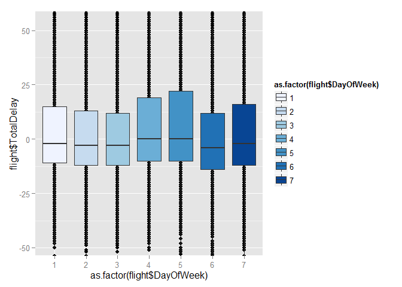
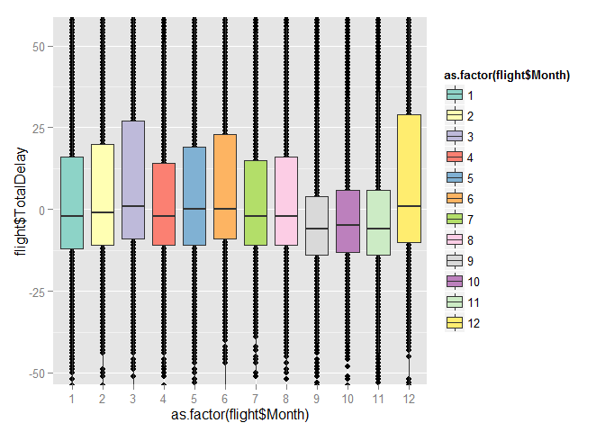

Flights at ABIA
---------------

``` r
library(ggplot2)
library(plyr)
```

Read in data.

``` r
flight = read.csv("https://raw.githubusercontent.com/jgscott/STA380/master/data/ABIA.csv")
attach(flight)
flight = data.frame(flight)
```

Add a column for total delay, which is the combined arrival and departure delay.

``` r
total_delay = ArrDelay + DepDelay
total_delay[is.na(total_delay)] = 0
flight["TotalDelay"] = total_delay
```



From this plot, we can see that Thursdays and Fridays have the worst delays, and Saturday is the best day to fly.



From this plot, we can see that the worst delays are in March and December. This probably corresponds to Spring and Winter break, as well as inclement weather in the Winter. The best months to fly in would be September through November.

Author Attribution
------------------

``` r
library(tm)
library(SnowballC)
library(glmnet)
```

### Naive Bayes Model

Read in directory of authors for training.

``` r
author_dirs = Sys.glob('../data/ReutersC50/C50train/*')
file_list = NULL
labels = NULL
for(author in author_dirs) {
    author_name = substring(author, first=29)
    files_to_add = Sys.glob(paste0(author, '/*.txt'))
    file_list = append(file_list, files_to_add)
    labels = append(labels, rep(author_name, length(files_to_add)))
}
```

Function to read plain text documents in English.

``` r
readerPlain = function(fname){
                readPlain(elem=list(content=readLines(fname)), 
                            id=fname, language='en') }
```

Remove the .txt from end of file names.

``` r
all_docs = lapply(file_list, readerPlain) 
names(all_docs) = file_list
names(all_docs) = sub('.txt', '', names(all_docs))

my_corpus = Corpus(VectorSource(all_docs))
names(my_corpus) = labels
```

Preprocess the documents.

``` r
my_corpus = tm_map(my_corpus, content_transformer(tolower)) # make everything lowercase
my_corpus = tm_map(my_corpus, content_transformer(removeNumbers)) # remove numbers
my_corpus = tm_map(my_corpus, content_transformer(removePunctuation)) # remove punctuation
my_corpus = tm_map(my_corpus, content_transformer(stripWhitespace)) # remove excess white-space
my_corpus = tm_map(my_corpus,stemDocument)   # stem the document 
my_corpus = tm_map(my_corpus, content_transformer(removeWords), stopwords("SMART"))    # remove smart words
```

Create Document Term Matrix

``` r
DTM = DocumentTermMatrix(my_corpus)
```

Set a threshold for the amount of documents a term has to be in for it to be relevant (\>5).

``` r
DTM = removeSparseTerms(DTM, 0.995)
```

Turn the DTM into a matrix.

``` r
X = as.matrix(DTM)
```

Apply Laplace smoothing and create a matrix of the multinomial log probability vector for each author.

``` r
smooth_count = 1/nrow(X)        # smoothing constant
X2 = rowsum(X + smooth_count,group = labels)
X2 = X2/rowSums(X2)
logX2 = log(X2)        #log probabilities 
```

Need to deal with words in the documents that weren't in the train sets.

Read in directory of authors for testing.

``` r
author_dirs = Sys.glob('../data/ReutersC50/C50test/*')
file_list = NULL
labels = NULL
for(author in author_dirs) {
    author_name = substring(author, first=28)
    files_to_add = Sys.glob(paste0(author, '/*.txt'))
    file_list = append(file_list, files_to_add)
    labels = append(labels, rep(author_name, length(files_to_add)))
}

#Remove the .txt from end of file names.

all_docs = lapply(file_list, readerPlain) 
names(all_docs) = file_list
names(all_docs) = sub('.txt', '', names(all_docs))

my_corpus2 = Corpus(VectorSource(all_docs))
names(my_corpus2) = labels

#Preprocess the documents.

my_corpus2 = tm_map(my_corpus2, content_transformer(tolower)) # make everything lowercase
my_corpus2 = tm_map(my_corpus2, content_transformer(removeNumbers)) # remove numbers
my_corpus2 = tm_map(my_corpus2, content_transformer(removePunctuation)) # remove punctuation
my_corpus2 = tm_map(my_corpus2, content_transformer(stripWhitespace)) # remove excess white-space
my_corpus2 = tm_map(my_corpus2, stemDocument)  # stem the document
my_corpus2 = tm_map(my_corpus2, content_transformer(removeWords), stopwords("SMART"))  # remove stop words


#Create Document Term Matrix
DTM2 = DocumentTermMatrix(my_corpus2)

#Set a threshold for the amount of documents a term has to be in for it to be relevant (>5).
DTM2 = removeSparseTerms(DTM2, 0.995)

#Turn the DTM into a matrix.
Xtest = as.matrix(DTM2)
```

Make modifications to the training and test matrices.

``` r
#Find all words in the test set that aren't in the training set and store them.
remove_test = NULL
for (word in colnames(Xtest)) {
  if (!word %in% colnames(logX2)) {
    remove_test = c(remove_test,word) 
  }
}

#Find all words in the training set that aren't in the test set and store them.
remove_train = NULL
for (word in colnames(logX2)) {
  if (!word %in% colnames(Xtest)) {
    remove_train = c(remove_train,word)
  }
}

#Create test and training matrices with the words removed.
Xtest_final = Xtest[, !colnames(Xtest) %in% remove_test]

#Create a matrix of zeros to attach onto test matrix for words in training set that aren't in the test set.
add = matrix(0,nrow(Xtest),length(remove_train))

#Name the columns of zeros with the missing words.
colnames(add) = remove_train
Xtest2 = cbind(Xtest_final,add)

#Reorder the test matrix so that the words are in the same order as the test set.
new_order = order(colnames(Xtest2))
Xtest_final = Xtest2[,new_order]
Xtrain_final = logX2
```

Run calculations to determine the predicted authors, and the accuracy of the model.

``` r
#Calculate the log probabilities through matrix multiplication, resulting in a matrix with document authors as rows, and the multinomial probability vector for each author as columns.   
logprobs = Xtest_final %*% t(Xtrain_final)

#Find the max in each row to see which author the model predicted the document to have.
max_col_names = colnames(logprobs)[max.col(logprobs)]
match = cbind(rownames(logprobs),max_col_names)
match = data.frame(match)
names(match) = c("actual","predicted")

#Use zeros and ones to represent whether or not the model prediction was correct.
matches = as.integer(max_col_names == rownames(logprobs)) 
#acc = cbind.data.frame(rownames(logprobs),matches)
acc = cbind.data.frame(rownames(logprobs),max_col_names, matches)
names(acc) = c("actual","predicted","matches")

#Take the mean of the zeros and ones for each author to see the accuracy of the model for each author.
acc_rate = cbind.data.frame(colnames(logprobs),colMeans(matrix(matches,50)))
names(acc_rate) = c("author","acc_perc")

#Accuracy of the entire model.
mean(acc_rate[,2])
```

    ## [1] 0.63

The Naive Bayes model gives an accuracy of about 63%.

Identify authors who were difficult to distinguish.

``` r
#Get counts and proportions of predictions for each document.
mis_pred = ddply(acc, .(actual), transform, sum = length(actual))
mis_pred_prop = ddply (mis_pred, .(actual, predicted), summarise, n = length(predicted), prop = n/sum[1])

#Identify the authors who had a prediction rate of less than 50%.
match_count = mis_pred_prop[mis_pred_prop$actual == mis_pred_prop$predicted,]
low_acc = match_count[match_count$prop < 0.5,]

#Only look at authors whose prediction rates are less than 50%.
mis_pred_prop[(mis_pred_prop$actual %in% low_acc$actual),]
```

    ##               actual        predicted  n prop
    ## 11    AlexanderSmith   AlexanderSmith 21 0.42
    ## 12    AlexanderSmith         JoeOrtiz 24 0.48
    ## 13    AlexanderSmith     JonathanBirt  1 0.02
    ## 14    AlexanderSmith      SamuelPerry  1 0.02
    ## 15    AlexanderSmith      SimonCowell  3 0.06
    ## 16   BenjaminKangLim  BenjaminKangLim 13 0.26
    ## 17   BenjaminKangLim   GrahamEarnshaw  2 0.04
    ## 18   BenjaminKangLim    JaneMacartney 13 0.26
    ## 19   BenjaminKangLim       MureDickie  2 0.04
    ## 20   BenjaminKangLim    PeterHumphrey  3 0.06
    ## 21   BenjaminKangLim      ScottHillis  8 0.16
    ## 22   BenjaminKangLim     WilliamKazer  9 0.18
    ## 39  DarrenSchuettler  BenjaminKangLim  1 0.02
    ## 40  DarrenSchuettler DarrenSchuettler 12 0.24
    ## 41  DarrenSchuettler HeatherScoffield 36 0.72
    ## 42  DarrenSchuettler      ScottHillis  1 0.02
    ## 43       DavidLawder      BradDorfman  8 0.16
    ## 44       DavidLawder      DavidLawder  7 0.14
    ## 45       DavidLawder   KevinDrawbaugh  2 0.04
    ## 46       DavidLawder  PatriciaCommins  3 0.06
    ## 47       DavidLawder       RobinSidel  4 0.08
    ## 48       DavidLawder       ToddNissen 26 0.52
    ## 74  HeatherScoffield DarrenSchuettler  5 0.10
    ## 75  HeatherScoffield HeatherScoffield 20 0.40
    ## 76  HeatherScoffield    JaneMacartney  5 0.10
    ## 77  HeatherScoffield     JohnMastrini  1 0.02
    ## 78  HeatherScoffield  LynnleyBrowning  1 0.02
    ## 79  HeatherScoffield     MarkBendeich  2 0.04
    ## 80  HeatherScoffield    PeterHumphrey  6 0.12
    ## 81  HeatherScoffield      SamuelPerry  2 0.04
    ## 82  HeatherScoffield      ScottHillis  3 0.06
    ## 83  HeatherScoffield     WilliamKazer  5 0.10
    ## 84     JaneMacartney  BenjaminKangLim  3 0.06
    ## 85     JaneMacartney   GrahamEarnshaw  2 0.04
    ## 86     JaneMacartney    JaneMacartney 16 0.32
    ## 87     JaneMacartney       MureDickie  3 0.06
    ## 88     JaneMacartney      ScottHillis 23 0.46
    ## 89     JaneMacartney     WilliamKazer  3 0.06
    ## 212       MureDickie   GrahamEarnshaw  2 0.04
    ## 213       MureDickie    JaneMacartney  6 0.12
    ## 214       MureDickie   LynneO'Donnell  1 0.02
    ## 215       MureDickie  LynnleyBrowning  1 0.02
    ## 216       MureDickie       MureDickie 16 0.32
    ## 217       MureDickie    PeterHumphrey  3 0.06
    ## 218       MureDickie       PierreTran  1 0.02
    ## 219       MureDickie     SarahDavison  1 0.02
    ## 220       MureDickie      ScottHillis  7 0.14
    ## 221       MureDickie         TanEeLyn  1 0.02
    ## 222       MureDickie     WilliamKazer 11 0.22
    ## 276      ScottHillis  BenjaminKangLim  1 0.02
    ## 277      ScottHillis    JaneMacartney 21 0.42
    ## 278      ScottHillis   LynneO'Donnell  1 0.02
    ## 279      ScottHillis       MureDickie  3 0.06
    ## 280      ScottHillis    PeterHumphrey  4 0.08
    ## 281      ScottHillis      ScottHillis 15 0.30
    ## 282      ScottHillis         TanEeLyn  3 0.06
    ## 283      ScottHillis     WilliamKazer  2 0.04
    ## 290         TanEeLyn       MureDickie  1 0.02
    ## 291         TanEeLyn    PeterHumphrey 20 0.40
    ## 292         TanEeLyn     SarahDavison 11 0.22
    ## 293         TanEeLyn      ScottHillis  2 0.04
    ## 294         TanEeLyn         TanEeLyn 16 0.32
    ## 306       ToddNissen      BradDorfman  2 0.04
    ## 307       ToddNissen      DavidLawder 12 0.24
    ## 308       ToddNissen      KarlPenhaul  7 0.14
    ## 309       ToddNissen   KevinDrawbaugh  2 0.04
    ## 310       ToddNissen    MichaelConnor  2 0.04
    ## 311       ToddNissen     SarahDavison  1 0.02
    ## 312       ToddNissen      ScottHillis  2 0.04
    ## 313       ToddNissen       ToddNissen 22 0.44
    ## 314     WilliamKazer  BenjaminKangLim  5 0.10
    ## 315     WilliamKazer   FumikoFujisaki  1 0.02
    ## 316     WilliamKazer   GrahamEarnshaw  3 0.06
    ## 317     WilliamKazer    JaneMacartney  7 0.14
    ## 318     WilliamKazer   LynneO'Donnell  1 0.02
    ## 319     WilliamKazer       MureDickie  3 0.06
    ## 320     WilliamKazer    PeterHumphrey  2 0.04
    ## 321     WilliamKazer     SarahDavison  2 0.04
    ## 322     WilliamKazer      ScottHillis  6 0.12
    ## 323     WilliamKazer         TanEeLyn  4 0.08
    ## 324     WilliamKazer     WilliamKazer 16 0.32

From this, we can see which authors were difficult to distinguish from one another. Alan Crosby was frequently identified as John Mastrini, about 32% of the time. Benjamin Kang Lim was also often mistaken as Jane Macartney and William Kazer. Darren Schuettler was very difficult to identify, as the model predicted his articles to be written by Heath Scoffield 70% of the time. David Lawder was thought to be Todd Nissen more than 50% of the time. Heather Scoffield was difficult to identify in general, as the model only predicted her correctly 38% of the times. James Macartney was mistakenly identified as Scott Hillis over 50% of the time. Jan Lopatka was frequently thought to be John Mastrini. Scott Hillis was also frequently identified as James Macartney, which means both authors must have very similar styles/word choice. Tan Ee Lyn was frequently mistaken for Peter Humphrey and Sarah Davison.

### Generalized Linear Model

Cross Validation

``` r
#Set up training and test sets from the training matrix.
cv_train = X[seq(1,2500,by = 2),]
cv_test = X[-seq(1,2500,by = 2),]
y_cv = rownames(cv_test)

#Increase the number of principal components considered by 250 each time.
k_list = seq(0,1000,by = 250)
pc_cv = prcomp(cv_train, scale=TRUE)

#Run the cross validation
cv_result = NULL
counter = 1

set.seed(5)
for (k in k_list[-1]) {
  V_cv = pc_cv$rotation[,1:k]
  score_cv = cv_train %*% V_cv
  glm_cv = glmnet(score_cv,as.factor(y_cv) ,family = "multinomial", alpha = 0)
  test_score_cv = cv_test %*% V_cv
  glm_cv_pred = predict(glm_cv,test_score_cv,type = "class", s = 0)
  cv_result[counter] = mean(as.integer(y_cv == glm_cv_pred))
  counter = counter + 1
}

#Select the k that gave the best prediction.
bestk = k_list[-1][which.max(cv_result)]
```

PCA & Multinomial Logistic Regression

``` r
#Run PCA on the document term matrix.
y = rownames(X)
pc_author = prcomp(X, scale=TRUE)

#Transform the DTM using the PCA results and then run the multinomial logistic regression.
V = pc_author$rotation[,1:bestk]
scores = X %*% V
glm_author = glmnet(scores,as.factor(y) ,family = "multinomial", alpha = 0)

#Use the model to predict on the transformed test DTM.
test_pc = Xtest_final %*% V
glm_pred = predict(glm_author,test_pc,type = "class", s = 0)

#Model overall accuracy.
mean(as.integer(y == glm_pred))
```

    ## [1] 0.6544

Multinomial Logistic Regression with PCA had an accuracy of about 65%.

Identify authors who were difficult to distinguish in the multinomial logistic regression.

``` r
#Data frame of actual author and predicted author.
matches2 = as.integer(glm_pred == rownames(Xtest_final)) 
match2 = cbind.data.frame(labels,glm_pred,matches2)
names(match2) = c("actual","predicted","match")

#Get counts and proportions of predictions for each document.
mis_pred2 = ddply(match2,.(actual),transform, sum = length(actual))
mis_pred_prop2 = ddply (mis_pred2, .(actual, predicted), summarise, n = length(predicted), prop = n/sum[1])

#Identify the authors who had a prediction rate of less than 50%.
match_count2 = mis_pred_prop2[mis_pred_prop2$actual == mis_pred_prop2$predicted,]
low_acc2 = match_count2[match_count2$prop < 0.5,]

#Only look at authors whose prediction rates are less than 50%.
mis_pred_prop2[(mis_pred_prop2$actual %in% low_acc2$actual),]
```

    ##               actual         predicted  n prop
    ## 11    AlexanderSmith     AaronPressman  1 0.02
    ## 12    AlexanderSmith    AlexanderSmith 19 0.38
    ## 13    AlexanderSmith          JoeOrtiz 20 0.40
    ## 14    AlexanderSmith      JonathanBirt  1 0.02
    ## 15    AlexanderSmith       SimonCowell  9 0.18
    ## 16   BenjaminKangLim   BenjaminKangLim 13 0.26
    ## 17   BenjaminKangLim    GrahamEarnshaw  2 0.04
    ## 18   BenjaminKangLim     JaneMacartney  7 0.14
    ## 19   BenjaminKangLim        MureDickie  8 0.16
    ## 20   BenjaminKangLim     PeterHumphrey  1 0.02
    ## 21   BenjaminKangLim       ScottHillis  9 0.18
    ## 22   BenjaminKangLim          TanEeLyn  3 0.06
    ## 23   BenjaminKangLim      WilliamKazer  7 0.14
    ## 37  DarrenSchuettler  DarrenSchuettler 11 0.22
    ## 38  DarrenSchuettler     EdnaFernandes  1 0.02
    ## 39  DarrenSchuettler  HeatherScoffield 35 0.70
    ## 40  DarrenSchuettler      JimGilchrist  1 0.02
    ## 41  DarrenSchuettler       KarlPenhaul  1 0.02
    ## 42  DarrenSchuettler         LydiaZajc  1 0.02
    ## 43       DavidLawder     BernardHickey  1 0.02
    ## 44       DavidLawder       BradDorfman  4 0.08
    ## 45       DavidLawder       DavidLawder 18 0.36
    ## 46       DavidLawder    KevinDrawbaugh  3 0.06
    ## 47       DavidLawder         NickLouth  1 0.02
    ## 48       DavidLawder   PatriciaCommins  4 0.08
    ## 49       DavidLawder        RobinSidel  3 0.06
    ## 50       DavidLawder        ToddNissen 16 0.32
    ## 63       EricAuchard    AlexanderSmith  2 0.04
    ## 64       EricAuchard     BernardHickey  1 0.02
    ## 65       EricAuchard       BradDorfman  2 0.04
    ## 66       EricAuchard       EricAuchard 19 0.38
    ## 67       EricAuchard    KevinDrawbaugh  1 0.02
    ## 68       EricAuchard KouroshKarimkhany  3 0.06
    ## 69       EricAuchard         NickLouth 11 0.22
    ## 70       EricAuchard   PatriciaCommins  2 0.04
    ## 71       EricAuchard      RogerFillion  1 0.02
    ## 72       EricAuchard       SamuelPerry  3 0.06
    ## 73       EricAuchard    TheresePoletti  5 0.10
    ## 84  HeatherScoffield     AaronPressman  1 0.02
    ## 85  HeatherScoffield   BenjaminKangLim  2 0.04
    ## 86  HeatherScoffield     BernardHickey  1 0.02
    ## 87  HeatherScoffield  DarrenSchuettler 12 0.24
    ## 88  HeatherScoffield  HeatherScoffield 19 0.38
    ## 89  HeatherScoffield     JaneMacartney  6 0.12
    ## 90  HeatherScoffield        JanLopatka  1 0.02
    ## 91  HeatherScoffield       KarlPenhaul  4 0.08
    ## 92  HeatherScoffield         LydiaZajc  1 0.02
    ## 93  HeatherScoffield        MartinWolk  1 0.02
    ## 94  HeatherScoffield       ScottHillis  2 0.04
    ## 95     JaneMacartney   BenjaminKangLim 10 0.20
    ## 96     JaneMacartney    GrahamEarnshaw  3 0.06
    ## 97     JaneMacartney     JaneMacartney 11 0.22
    ## 98     JaneMacartney        MureDickie  5 0.10
    ## 99     JaneMacartney       ScottHillis 10 0.20
    ## 100    JaneMacartney          TanEeLyn  1 0.02
    ## 101    JaneMacartney      WilliamKazer 10 0.20
    ## 222       MureDickie   BenjaminKangLim  1 0.02
    ## 223       MureDickie       BradDorfman  1 0.02
    ## 224       MureDickie    GrahamEarnshaw  1 0.02
    ## 225       MureDickie     JaneMacartney  4 0.08
    ## 226       MureDickie    LynneO'Donnell  1 0.02
    ## 227       MureDickie        MureDickie 17 0.34
    ## 228       MureDickie     PeterHumphrey  2 0.04
    ## 229       MureDickie       ScottHillis  7 0.14
    ## 230       MureDickie          TanEeLyn  2 0.04
    ## 231       MureDickie      WilliamKazer 14 0.28
    ## 290      ScottHillis   BenjaminKangLim  3 0.06
    ## 291      ScottHillis     JaneMacartney 11 0.22
    ## 292      ScottHillis   LynnleyBrowning  1 0.02
    ## 293      ScottHillis        MureDickie 15 0.30
    ## 294      ScottHillis       ScottHillis  7 0.14
    ## 295      ScottHillis          TanEeLyn  8 0.16
    ## 296      ScottHillis      WilliamKazer  5 0.10
    ## 325       ToddNissen     BernardHickey  1 0.02
    ## 326       ToddNissen       BradDorfman  2 0.04
    ## 327       ToddNissen       DavidLawder 12 0.24
    ## 328       ToddNissen       KarlPenhaul  4 0.08
    ## 329       ToddNissen    KevinDrawbaugh  1 0.02
    ## 330       ToddNissen     MichaelConnor  4 0.08
    ## 331       ToddNissen   PatriciaCommins  2 0.04
    ## 332       ToddNissen       ScottHillis  2 0.04
    ## 333       ToddNissen        ToddNissen 22 0.44
    ## 334     WilliamKazer   BenjaminKangLim  7 0.14
    ## 335     WilliamKazer    GrahamEarnshaw  3 0.06
    ## 336     WilliamKazer     JaneMacartney  6 0.12
    ## 337     WilliamKazer KouroshKarimkhany  1 0.02
    ## 338     WilliamKazer    LynneO'Donnell  1 0.02
    ## 339     WilliamKazer      MarkBendeich  1 0.02
    ## 340     WilliamKazer        MureDickie  4 0.08
    ## 341     WilliamKazer     PeterHumphrey  1 0.02
    ## 342     WilliamKazer       ScottHillis  2 0.04
    ## 343     WilliamKazer          TanEeLyn  6 0.12
    ## 344     WilliamKazer      WilliamKazer 18 0.36

Alexander Smith was often mistaken to be Joe Ortiz. Benjamin Kang Lim was still difficult to predict, with the model being successful only 26% of the time. Darren Schuettler was still mistakenly identified as Heather Scoffield, about 70% of the time. David Lawder was also still difficult to distinguish from Todd Nissen. Heather Scoffield was similarly mistaken for Darren Schuettler. Jane Macartney was difficult to identify, with a model accuracy of only 22%. Scott Hillis was similar, with a model accuracy of 14%. William Kazer had a low prediction rate as well, only about 36%.

Out of the two models, I would prefer the Naive Bayes model. Since the accuracies were roughly the same, no model is definitively better than the other. Therefore, I would choose the computationally simpler model, which is Naive Bayes. The cross validation in the PCA and Multinomial Logistic Regression model is very computationally expensive, and took a long time to run. Additionally, if the data set was larger, running the principal component analysis as well as the multinomial logistic regression would use a lot of memory.

Practice with association rule mining
-------------------------------------

``` r
library(arules)
library(reshape)
```

Read in data as a transaction object.

``` r
grocery = read.transactions("https://raw.githubusercontent.com/jgscott/STA380/master/data/groceries.txt",format="basket",sep=",")
```

Running the 'apriori' algorithm. Look at rules with support \> .001 & confidence \>.6 & length (\# items) \<= 4. We are using a low support in order to capture more rules. When inspecting, we can simply inspect the rules with higher supports. We also want confidence to be fairly high, and so it is set higher than 0.5 since the lower support is already increasing the number of rules.

``` r
grocrules <- apriori(grocery,parameter=list(support=.001, confidence=.6, maxlen=4))
```

    ## 
    ## Parameter specification:
    ##  confidence minval smax arem  aval originalSupport support minlen maxlen
    ##         0.6    0.1    1 none FALSE            TRUE   0.001      1      4
    ##  target   ext
    ##   rules FALSE
    ## 
    ## Algorithmic control:
    ##  filter tree heap memopt load sort verbose
    ##     0.1 TRUE TRUE  FALSE TRUE    2    TRUE
    ## 
    ## apriori - find association rules with the apriori algorithm
    ## version 4.21 (2004.05.09)        (c) 1996-2004   Christian Borgelt
    ## set item appearances ...[0 item(s)] done [0.00s].
    ## set transactions ...[169 item(s), 9835 transaction(s)] done [0.00s].
    ## sorting and recoding items ... [157 item(s)] done [0.00s].
    ## creating transaction tree ... done [0.00s].
    ## checking subsets of size 1 2 3 4 done [0.01s].
    ## writing ... [2258 rule(s)] done [0.00s].
    ## creating S4 object  ... done [0.00s].

### Inspect the rules at different levels of support and lift.

``` r
inspect(subset(grocrules, subset = support > 0.005))
```

    ##    lhs                        rhs                    support confidence     lift
    ## 1  {onions,                                                                     
    ##     root vegetables}       => {other vegetables} 0.005693950  0.6021505 3.112008
    ## 2  {curd,                                                                       
    ##     tropical fruit}        => {whole milk}       0.006507372  0.6336634 2.479936
    ## 3  {domestic eggs,                                                              
    ##     margarine}             => {whole milk}       0.005185562  0.6219512 2.434099
    ## 4  {butter,                                                                     
    ##     domestic eggs}         => {whole milk}       0.005998983  0.6210526 2.430582
    ## 5  {butter,                                                                     
    ##     whipped/sour cream}    => {whole milk}       0.006710727  0.6600000 2.583008
    ## 6  {bottled water,                                                              
    ##     butter}                => {whole milk}       0.005388917  0.6022727 2.357084
    ## 7  {butter,                                                                     
    ##     tropical fruit}        => {whole milk}       0.006202339  0.6224490 2.436047
    ## 8  {butter,                                                                     
    ##     root vegetables}       => {whole milk}       0.008235892  0.6377953 2.496107
    ## 9  {butter,                                                                     
    ##     yogurt}                => {whole milk}       0.009354347  0.6388889 2.500387
    ## 10 {domestic eggs,                                                              
    ##     pip fruit}             => {whole milk}       0.005388917  0.6235294 2.440275
    ## 11 {domestic eggs,                                                              
    ##     tropical fruit}        => {whole milk}       0.006914082  0.6071429 2.376144
    ## 12 {pip fruit,                                                                  
    ##     whipped/sour cream}    => {other vegetables} 0.005592272  0.6043956 3.123610
    ## 13 {pip fruit,                                                                  
    ##     whipped/sour cream}    => {whole milk}       0.005998983  0.6483516 2.537421
    ## 14 {fruit/vegetable juice,                                                      
    ##     other vegetables,                                                           
    ##     yogurt}                => {whole milk}       0.005083884  0.6172840 2.415833
    ## 15 {other vegetables,                                                           
    ##     root vegetables,                                                            
    ##     whipped/sour cream}    => {whole milk}       0.005185562  0.6071429 2.376144
    ## 16 {other vegetables,                                                           
    ##     pip fruit,                                                                  
    ##     root vegetables}       => {whole milk}       0.005490595  0.6750000 2.641713
    ## 17 {pip fruit,                                                                  
    ##     root vegetables,                                                            
    ##     whole milk}            => {other vegetables} 0.005490595  0.6136364 3.171368
    ## 18 {other vegetables,                                                           
    ##     pip fruit,                                                                  
    ##     yogurt}                => {whole milk}       0.005083884  0.6250000 2.446031
    ## 19 {citrus fruit,                                                               
    ##     root vegetables,                                                            
    ##     whole milk}            => {other vegetables} 0.005795628  0.6333333 3.273165
    ## 20 {root vegetables,                                                            
    ##     tropical fruit,                                                             
    ##     yogurt}                => {whole milk}       0.005693950  0.7000000 2.739554
    ## 21 {other vegetables,                                                           
    ##     tropical fruit,                                                             
    ##     yogurt}                => {whole milk}       0.007625826  0.6198347 2.425816
    ## 22 {other vegetables,                                                           
    ##     root vegetables,                                                            
    ##     yogurt}                => {whole milk}       0.007829181  0.6062992 2.372842

With a support greater than .005, we see that for various combinations of groceries, it is likely that whole milk will also be bought.

``` r
inspect(subset(grocrules, subset=lift > 5 & support > 0.002))
```

    ##   lhs                    rhs                   support confidence     lift
    ## 1 {herbs,                                                                 
    ##    other vegetables,                                                      
    ##    whole milk}        => {root vegetables} 0.002440264  0.6000000 5.504664
    ## 2 {citrus fruit,                                                          
    ##    frozen vegetables,                                                     
    ##    other vegetables}  => {root vegetables} 0.002033554  0.6250000 5.734025
    ## 3 {beef,                                                                  
    ##    citrus fruit,                                                          
    ##    other vegetables}  => {root vegetables} 0.002135231  0.6363636 5.838280
    ## 4 {beef,                                                                  
    ##    other vegetables,                                                      
    ##    tropical fruit}    => {root vegetables} 0.002745297  0.6136364 5.629770

With lift greater than 5 and support greater than .002, we see four different combinations of groceries that will likely also have root vegetables bought with them. The four different combinations seem to be made up of either meat, vegetables, or fruits.

``` r
inspect(subset(grocrules, subset=lift > 5))
```

    ##     lhs                        rhs                         support confidence      lift
    ## 1   {liquor,                                                                           
    ##      red/blush wine}        => {bottled beer}          0.001931876  0.9047619 11.235269
    ## 2   {popcorn,                                                                          
    ##      soda}                  => {salty snack}           0.001220132  0.6315789 16.697793
    ## 3   {Instant food products,                                                            
    ##      soda}                  => {hamburger meat}        0.001220132  0.6315789 18.995654
    ## 4   {root vegetables,                                                                  
    ##      turkey}                => {tropical fruit}        0.001525165  0.6000000  5.718023
    ## 5   {rice,                                                                             
    ##      yogurt}                => {root vegetables}       0.001626843  0.6956522  6.382219
    ## 6   {pip fruit,                                                                        
    ##      salt}                  => {root vegetables}       0.001016777  0.6666667  6.116294
    ## 7   {bottled beer,                                                                     
    ##      herbs}                 => {bottled water}         0.001220132  0.6315789  5.714424
    ## 8   {herbs,                                                                            
    ##      sausage}               => {root vegetables}       0.001016777  0.6666667  6.116294
    ## 9   {herbs,                                                                            
    ##      tropical fruit}        => {root vegetables}       0.001728521  0.6071429  5.570196
    ## 10  {herbs,                                                                            
    ##      rolls/buns}            => {root vegetables}       0.001830198  0.6000000  5.504664
    ## 11  {ham,                                                                              
    ##      processed cheese}      => {white bread}           0.001931876  0.6333333 15.045491
    ## 12  {misc. beverages,                                                                  
    ##      pip fruit}             => {tropical fruit}        0.001321810  0.6190476  5.899548
    ## 13  {frozen vegetables,                                                                
    ##      specialty chocolate}   => {fruit/vegetable juice} 0.001016777  0.6250000  8.645394
    ## 14  {berries,                                                                          
    ##      bottled beer}          => {root vegetables}       0.001016777  0.6250000  5.734025
    ## 15  {other vegetables,                                                                 
    ##      tropical fruit,                                                                   
    ##      turkey}                => {root vegetables}       0.001220132  0.7500000  6.880830
    ## 16  {other vegetables,                                                                 
    ##      root vegetables,                                                                  
    ##      turkey}                => {tropical fruit}        0.001220132  0.6315789  6.018972
    ## 17  {butter,                                                                           
    ##      rice,                                                                             
    ##      whole milk}            => {root vegetables}       0.001016777  0.6666667  6.116294
    ## 18  {other vegetables,                                                                 
    ##      rice,                                                                             
    ##      yogurt}                => {root vegetables}       0.001423488  0.7368421  6.760114
    ## 19  {rice,                                                                             
    ##      whole milk,                                                                       
    ##      yogurt}                => {root vegetables}       0.001423488  0.7777778  7.135676
    ## 20  {other vegetables,                                                                 
    ##      rice,                                                                             
    ##      whole milk}            => {root vegetables}       0.001830198  0.6923077  6.351536
    ## 21  {mayonnaise,                                                                       
    ##      other vegetables,                                                                 
    ##      yogurt}                => {root vegetables}       0.001016777  0.6250000  5.734025
    ## 22  {frozen fish,                                                                      
    ##      other vegetables,                                                                 
    ##      pip fruit}             => {tropical fruit}        0.001016777  0.7142857  6.807171
    ## 23  {frozen fish,                                                                      
    ##      other vegetables,                                                                 
    ##      tropical fruit}        => {pip fruit}             0.001016777  0.6666667  8.812724
    ## 24  {curd,                                                                             
    ##      herbs,                                                                            
    ##      whole milk}            => {root vegetables}       0.001220132  0.6666667  6.116294
    ## 25  {butter,                                                                           
    ##      herbs,                                                                            
    ##      whole milk}            => {root vegetables}       0.001016777  0.6250000  5.734025
    ## 26  {herbs,                                                                            
    ##      pip fruit,                                                                        
    ##      whole milk}            => {root vegetables}       0.001016777  0.6666667  6.116294
    ## 27  {herbs,                                                                            
    ##      other vegetables,                                                                 
    ##      tropical fruit}        => {citrus fruit}          0.001016777  0.6250000  7.551443
    ## 28  {citrus fruit,                                                                     
    ##      herbs,                                                                            
    ##      other vegetables}      => {root vegetables}       0.001321810  0.6190476  5.679415
    ## 29  {citrus fruit,                                                                     
    ##      herbs,                                                                            
    ##      whole milk}            => {root vegetables}       0.001321810  0.6842105  6.277249
    ## 30  {bottled water,                                                                    
    ##      herbs,                                                                            
    ##      other vegetables}      => {root vegetables}       0.001016777  0.7142857  6.553172
    ## 31  {herbs,                                                                            
    ##      other vegetables,                                                                 
    ##      tropical fruit}        => {root vegetables}       0.001118454  0.6875000  6.307428
    ## 32  {herbs,                                                                            
    ##      tropical fruit,                                                                   
    ##      whole milk}            => {root vegetables}       0.001525165  0.6521739  5.983331
    ## 33  {herbs,                                                                            
    ##      other vegetables,                                                                 
    ##      yogurt}                => {root vegetables}       0.001321810  0.6500000  5.963386
    ## 34  {herbs,                                                                            
    ##      other vegetables,                                                                 
    ##      rolls/buns}            => {root vegetables}       0.001220132  0.6666667  6.116294
    ## 35  {herbs,                                                                            
    ##      rolls/buns,                                                                       
    ##      whole milk}            => {root vegetables}       0.001525165  0.6250000  5.734025
    ## 36  {herbs,                                                                            
    ##      other vegetables,                                                                 
    ##      whole milk}            => {root vegetables}       0.002440264  0.6000000  5.504664
    ## 37  {other vegetables,                                                                 
    ##      processed cheese,                                                                 
    ##      whole milk}            => {root vegetables}       0.001525165  0.6000000  5.504664
    ## 38  {flour,                                                                            
    ##      margarine,                                                                        
    ##      other vegetables}      => {yogurt}                0.001016777  0.7142857  5.120262
    ## 39  {flour,                                                                            
    ##      whipped/sour cream,                                                               
    ##      whole milk}            => {root vegetables}       0.001728521  0.6800000  6.238619
    ## 40  {curd,                                                                             
    ##      soft cheese,                                                                      
    ##      whole milk}            => {yogurt}                0.001118454  0.7857143  5.632289
    ## 41  {fruit/vegetable juice,                                                            
    ##      soft cheese,                                                                      
    ##      whole milk}            => {yogurt}                0.001220132  0.7058824  5.060024
    ## 42  {soft cheese,                                                                      
    ##      whipped/sour cream,                                                               
    ##      whole milk}            => {root vegetables}       0.001220132  0.6000000  5.504664
    ## 43  {citrus fruit,                                                                     
    ##      root vegetables,                                                                  
    ##      soft cheese}           => {other vegetables}      0.001016777  1.0000000  5.168156
    ## 44  {citrus fruit,                                                                     
    ##      other vegetables,                                                                 
    ##      soft cheese}           => {root vegetables}       0.001016777  0.6666667  6.116294
    ## 45  {soft cheese,                                                                      
    ##      tropical fruit,                                                                   
    ##      whole milk}            => {yogurt}                0.001525165  0.7142857  5.120262
    ## 46  {fruit/vegetable juice,                                                            
    ##      misc. beverages,                                                                  
    ##      other vegetables}      => {tropical fruit}        0.001016777  0.6666667  6.353359
    ## 47  {citrus fruit,                                                                     
    ##      fruit/vegetable juice,                                                            
    ##      grapes}                => {tropical fruit}        0.001118454  0.8461538  8.063879
    ## 48  {fruit/vegetable juice,                                                            
    ##      grapes,                                                                           
    ##      tropical fruit}        => {citrus fruit}          0.001118454  0.6875000  8.306588
    ## 49  {citrus fruit,                                                                     
    ##      grapes,                                                                           
    ##      tropical fruit}        => {fruit/vegetable juice} 0.001118454  0.6111111  8.453274
    ## 50  {fruit/vegetable juice,                                                            
    ##      grapes,                                                                           
    ##      other vegetables}      => {tropical fruit}        0.001118454  0.7857143  7.487888
    ## 51  {citrus fruit,                                                                     
    ##      grapes,                                                                           
    ##      other vegetables}      => {tropical fruit}        0.001220132  0.7058824  6.727086
    ## 52  {cat food,                                                                         
    ##      citrus fruit,                                                                     
    ##      other vegetables}      => {root vegetables}       0.001118454  0.6875000  6.307428
    ## 53  {frankfurter,                                                                      
    ##      frozen meals,                                                                     
    ##      other vegetables}      => {tropical fruit}        0.001016777  0.6666667  6.353359
    ## 54  {butter,                                                                           
    ##      frozen meals,                                                                     
    ##      whole milk}            => {tropical fruit}        0.001016777  0.6250000  5.956274
    ## 55  {frozen meals,                                                                     
    ##      pip fruit,                                                                        
    ##      whole milk}            => {tropical fruit}        0.001525165  0.6818182  6.497754
    ## 56  {frozen meals,                                                                     
    ##      other vegetables,                                                                 
    ##      yogurt}                => {root vegetables}       0.001321810  0.6500000  5.963386
    ## 57  {butter,                                                                           
    ##      hard cheese,                                                                      
    ##      yogurt}                => {whipped/sour cream}    0.001016777  0.6250000  8.718972
    ## 58  {butter,                                                                           
    ##      hard cheese,                                                                      
    ##      other vegetables}      => {whipped/sour cream}    0.001220132  0.6000000  8.370213
    ## 59  {butter,                                                                           
    ##      hard cheese,                                                                      
    ##      whole milk}            => {whipped/sour cream}    0.001423488  0.6666667  9.300236
    ## 60  {domestic eggs,                                                                    
    ##      hard cheese,                                                                      
    ##      other vegetables}      => {root vegetables}       0.001220132  0.6315789  5.794383
    ## 61  {butter milk,                                                                      
    ##      other vegetables,                                                                 
    ##      pastry}                => {yogurt}                0.001220132  0.8000000  5.734694
    ## 62  {butter milk,                                                                      
    ##      pastry,                                                                           
    ##      whole milk}            => {yogurt}                0.001423488  0.7368421  5.281955
    ## 63  {candy,                                                                            
    ##      rolls/buns,                                                                       
    ##      yogurt}                => {tropical fruit}        0.001118454  0.6470588  6.166496
    ## 64  {candy,                                                                            
    ##      tropical fruit,                                                                   
    ##      whole milk}            => {yogurt}                0.001016777  0.7692308  5.514129
    ## 65  {fruit/vegetable juice,                                                            
    ##      ham,                                                                              
    ##      other vegetables}      => {tropical fruit}        0.001016777  0.7142857  6.807171
    ## 66  {ham,                                                                              
    ##      other vegetables,                                                                 
    ##      pip fruit}             => {tropical fruit}        0.001626843  0.6153846  5.864639
    ## 67  {ham,                                                                              
    ##      other vegetables,                                                                 
    ##      tropical fruit}        => {pip fruit}             0.001626843  0.6153846  8.134822
    ## 68  {curd,                                                                             
    ##      sliced cheese,                                                                    
    ##      whole milk}            => {yogurt}                0.001016777  0.7142857  5.120262
    ## 69  {frankfurter,                                                                      
    ##      sliced cheese,                                                                    
    ##      whole milk}            => {root vegetables}       0.001016777  0.6250000  5.734025
    ## 70  {butter,                                                                           
    ##      sliced cheese,                                                                    
    ##      whole milk}            => {whipped/sour cream}    0.001220132  0.6000000  8.370213
    ## 71  {butter,                                                                           
    ##      sliced cheese,                                                                    
    ##      tropical fruit}        => {yogurt}                0.001118454  0.7857143  5.632289
    ## 72  {butter,                                                                           
    ##      sliced cheese,                                                                    
    ##      yogurt}                => {tropical fruit}        0.001118454  0.6111111  5.823913
    ## 73  {butter,                                                                           
    ##      other vegetables,                                                                 
    ##      sliced cheese}         => {tropical fruit}        0.001118454  0.6111111  5.823913
    ## 74  {butter,                                                                           
    ##      sliced cheese,                                                                    
    ##      whole milk}            => {yogurt}                0.001423488  0.7000000  5.017857
    ## 75  {sliced cheese,                                                                    
    ##      tropical fruit,                                                                   
    ##      whipped/sour cream}    => {yogurt}                0.001016777  0.7142857  5.120262
    ## 76  {sliced cheese,                                                                    
    ##      whipped/sour cream,                                                               
    ##      yogurt}                => {root vegetables}       0.001220132  0.6315789  5.794383
    ## 77  {other vegetables,                                                                 
    ##      sliced cheese,                                                                    
    ##      whipped/sour cream}    => {root vegetables}       0.001321810  0.6190476  5.679415
    ## 78  {pip fruit,                                                                        
    ##      sausage,                                                                          
    ##      sliced cheese}         => {yogurt}                0.001220132  0.8571429  6.144315
    ## 79  {pip fruit,                                                                        
    ##      sliced cheese,                                                                    
    ##      yogurt}                => {sausage}               0.001220132  0.6000000  6.386364
    ## 80  {butter,                                                                           
    ##      oil,                                                                              
    ##      whole milk}            => {root vegetables}       0.001220132  0.6666667  6.116294
    ## 81  {citrus fruit,                                                                     
    ##      fruit/vegetable juice,                                                            
    ##      oil}                   => {root vegetables}       0.001016777  0.7692308  7.057262
    ## 82  {fruit/vegetable juice,                                                            
    ##      oil,                                                                              
    ##      whole milk}            => {root vegetables}       0.001220132  0.6315789  5.794383
    ## 83  {citrus fruit,                                                                     
    ##      oil,                                                                              
    ##      other vegetables}      => {root vegetables}       0.001626843  0.6400000  5.871642
    ## 84  {oil,                                                                              
    ##      shopping bags,                                                                    
    ##      whole milk}            => {root vegetables}       0.001016777  0.6666667  6.116294
    ## 85  {oil,                                                                              
    ##      other vegetables,                                                                 
    ##      tropical fruit}        => {root vegetables}       0.001728521  0.6800000  6.238619
    ## 86  {oil,                                                                              
    ##      tropical fruit,                                                                   
    ##      whole milk}            => {root vegetables}       0.001525165  0.6000000  5.504664
    ## 87  {frozen vegetables,                                                                
    ##      onions,                                                                           
    ##      other vegetables}      => {root vegetables}       0.001321810  0.6190476  5.679415
    ## 88  {butter,                                                                           
    ##      onions,                                                                           
    ##      tropical fruit}        => {yogurt}                0.001118454  0.7857143  5.632289
    ## 89  {butter,                                                                           
    ##      onions,                                                                           
    ##      yogurt}                => {tropical fruit}        0.001118454  0.6875000  6.551902
    ## 90  {butter,                                                                           
    ##      onions,                                                                           
    ##      other vegetables}      => {root vegetables}       0.001525165  0.6521739  5.983331
    ## 91  {hamburger meat,                                                                   
    ##      whipped/sour cream,                                                               
    ##      yogurt}                => {butter}                0.001016777  0.6250000 11.278670
    ## 92  {citrus fruit,                                                                     
    ##      hygiene articles,                                                                 
    ##      pip fruit}             => {tropical fruit}        0.001016777  0.6666667  6.353359
    ## 93  {beef,                                                                             
    ##      other vegetables,                                                                 
    ##      sugar}                 => {root vegetables}       0.001118454  0.6470588  5.936403
    ## 94  {curd,                                                                             
    ##      sugar,                                                                            
    ##      whipped/sour cream}    => {yogurt}                0.001016777  0.7142857  5.120262
    ## 95  {curd,                                                                             
    ##      sugar,                                                                            
    ##      yogurt}                => {whipped/sour cream}    0.001016777  0.6250000  8.718972
    ## 96  {butter,                                                                           
    ##      other vegetables,                                                                 
    ##      sugar}                 => {whipped/sour cream}    0.001016777  0.7142857  9.964539
    ## 97  {beef,                                                                             
    ##      cream cheese ,                                                                    
    ##      yogurt}                => {root vegetables}       0.001118454  0.6111111  5.606602
    ## 98  {cream cheese ,                                                                    
    ##      curd,                                                                             
    ##      whipped/sour cream}    => {yogurt}                0.001321810  0.7647059  5.481693
    ## 99  {cream cheese ,                                                                    
    ##      curd,                                                                             
    ##      other vegetables}      => {root vegetables}       0.001728521  0.6296296  5.776499
    ## 100 {cream cheese ,                                                                    
    ##      margarine,                                                                        
    ##      whipped/sour cream}    => {yogurt}                0.001016777  0.8333333  5.973639
    ## 101 {cream cheese ,                                                                    
    ##      margarine,                                                                        
    ##      whole milk}            => {yogurt}                0.001423488  0.7777778  5.575397
    ## 102 {butter,                                                                           
    ##      cream cheese ,                                                                    
    ##      whipped/sour cream}    => {yogurt}                0.001016777  0.7692308  5.514129
    ## 103 {butter,                                                                           
    ##      cream cheese ,                                                                    
    ##      root vegetables}       => {yogurt}                0.001016777  0.9090909  6.516698
    ## 104 {cream cheese ,                                                                    
    ##      pip fruit,                                                                        
    ##      whipped/sour cream}    => {yogurt}                0.001016777  0.7142857  5.120262
    ## 105 {cream cheese ,                                                                    
    ##      sausage,                                                                          
    ##      whipped/sour cream}    => {yogurt}                0.001016777  0.7692308  5.514129
    ## 106 {cream cheese ,                                                                    
    ##      root vegetables,                                                                  
    ##      whipped/sour cream}    => {yogurt}                0.001525165  0.7142857  5.120262
    ## 107 {cream cheese ,                                                                    
    ##      rolls/buns,                                                                       
    ##      root vegetables}       => {yogurt}                0.001016777  0.7142857  5.120262
    ## 108 {chicken,                                                                          
    ##      citrus fruit,                                                                     
    ##      sausage}               => {root vegetables}       0.001016777  0.7692308  7.057262
    ## 109 {butter,                                                                           
    ##      tropical fruit,                                                                   
    ##      white bread}           => {yogurt}                0.001118454  0.8461538  6.065542
    ## 110 {pip fruit,                                                                        
    ##      root vegetables,                                                                  
    ##      white bread}           => {yogurt}                0.001220132  0.7058824  5.060024
    ## 111 {chocolate,                                                                        
    ##      citrus fruit,                                                                     
    ##      pip fruit}             => {tropical fruit}        0.001016777  0.6250000  5.956274
    ## 112 {coffee,                                                                           
    ##      tropical fruit,                                                                   
    ##      whole milk}            => {yogurt}                0.001931876  0.7037037  5.044407
    ## 113 {citrus fruit,                                                                     
    ##      frozen vegetables,                                                                
    ##      whipped/sour cream}    => {root vegetables}       0.001118454  0.6111111  5.606602
    ## 114 {citrus fruit,                                                                     
    ##      frozen vegetables,                                                                
    ##      pip fruit}             => {root vegetables}       0.001016777  0.6250000  5.734025
    ## 115 {citrus fruit,                                                                     
    ##      frozen vegetables,                                                                
    ##      tropical fruit}        => {root vegetables}       0.001118454  0.6875000  6.307428
    ## 116 {citrus fruit,                                                                     
    ##      frozen vegetables,                                                                
    ##      other vegetables}      => {root vegetables}       0.002033554  0.6250000  5.734025
    ## 117 {beef,                                                                             
    ##      curd,                                                                             
    ##      other vegetables}      => {root vegetables}       0.001321810  0.6190476  5.679415
    ## 118 {beef,                                                                             
    ##      napkins,                                                                          
    ##      other vegetables}      => {root vegetables}       0.001118454  0.6111111  5.606602
    ## 119 {beef,                                                                             
    ##      butter,                                                                           
    ##      sausage}               => {root vegetables}       0.001016777  0.7142857  6.553172
    ## 120 {beef,                                                                             
    ##      butter,                                                                           
    ##      tropical fruit}        => {yogurt}                0.001016777  0.8333333  5.973639
    ## 121 {beef,                                                                             
    ##      butter,                                                                           
    ##      rolls/buns}            => {root vegetables}       0.001423488  0.6363636  5.838280
    ## 122 {beef,                                                                             
    ##      citrus fruit,                                                                     
    ##      whipped/sour cream}    => {root vegetables}       0.001016777  0.7692308  7.057262
    ## 123 {beef,                                                                             
    ##      citrus fruit,                                                                     
    ##      tropical fruit}        => {root vegetables}       0.001220132  0.6000000  5.504664
    ## 124 {beef,                                                                             
    ##      citrus fruit,                                                                     
    ##      other vegetables}      => {root vegetables}       0.002135231  0.6363636  5.838280
    ## 125 {beef,                                                                             
    ##      sausage,                                                                          
    ##      tropical fruit}        => {root vegetables}       0.001016777  0.6250000  5.734025
    ## 126 {beef,                                                                             
    ##      sausage,                                                                          
    ##      yogurt}                => {root vegetables}       0.001321810  0.6842105  6.277249
    ## 127 {beef,                                                                             
    ##      rolls/buns,                                                                       
    ##      sausage}               => {root vegetables}       0.001220132  0.6315789  5.794383
    ## 128 {beef,                                                                             
    ##      rolls/buns,                                                                       
    ##      tropical fruit}        => {root vegetables}       0.001728521  0.6296296  5.776499
    ## 129 {beef,                                                                             
    ##      other vegetables,                                                                 
    ##      tropical fruit}        => {root vegetables}       0.002745297  0.6136364  5.629770
    ## 130 {curd,                                                                             
    ##      margarine,                                                                        
    ##      whipped/sour cream}    => {yogurt}                0.001016777  0.7692308  5.514129
    ## 131 {butter,                                                                           
    ##      curd,                                                                             
    ##      tropical fruit}        => {yogurt}                0.001525165  0.7894737  5.659237
    ## 132 {curd,                                                                             
    ##      pip fruit,                                                                        
    ##      sausage}               => {yogurt}                0.001321810  0.7222222  5.177154
    ## 133 {fruit/vegetable juice,                                                            
    ##      pork,                                                                             
    ##      tropical fruit}        => {yogurt}                0.001016777  0.8333333  5.973639
    ## 134 {fruit/vegetable juice,                                                            
    ##      other vegetables,                                                                 
    ##      pork}                  => {root vegetables}       0.001525165  0.6000000  5.504664
    ## 135 {domestic eggs,                                                                    
    ##      frankfurter,                                                                      
    ##      pip fruit}             => {tropical fruit}        0.001016777  0.6250000  5.956274
    ## 136 {domestic eggs,                                                                    
    ##      frankfurter,                                                                      
    ##      tropical fruit}        => {pip fruit}             0.001016777  0.6250000  8.261929
    ## 137 {frankfurter,                                                                      
    ##      fruit/vegetable juice,                                                            
    ##      other vegetables}      => {tropical fruit}        0.001016777  0.6250000  5.956274
    ## 138 {brown bread,                                                                      
    ##      citrus fruit,                                                                     
    ##      fruit/vegetable juice} => {tropical fruit}        0.001016777  0.6250000  5.956274
    ## 139 {brown bread,                                                                      
    ##      pip fruit,                                                                        
    ##      whipped/sour cream}    => {other vegetables}      0.001118454  1.0000000  5.168156
    ## 140 {butter,                                                                           
    ##      margarine,                                                                        
    ##      tropical fruit}        => {yogurt}                0.001118454  0.8461538  6.065542
    ## 141 {margarine,                                                                        
    ##      tropical fruit,                                                                   
    ##      whipped/sour cream}    => {yogurt}                0.001525165  0.7142857  5.120262
    ## 142 {fruit/vegetable juice,                                                            
    ##      pastry,                                                                           
    ##      whipped/sour cream}    => {yogurt}                0.001220132  0.8000000  5.734694
    ## 143 {fruit/vegetable juice,                                                            
    ##      pip fruit,                                                                        
    ##      rolls/buns}            => {tropical fruit}        0.001016777  0.6250000  5.956274
    ## 144 {bottled water,                                                                    
    ##      fruit/vegetable juice,                                                            
    ##      pastry}                => {yogurt}                0.001321810  0.7647059  5.481693
    ## 145 {pip fruit,                                                                        
    ##      shopping bags,                                                                    
    ##      whipped/sour cream}    => {tropical fruit}        0.001118454  0.6111111  5.823913
    ## 146 {shopping bags,                                                                    
    ##      tropical fruit,                                                                   
    ##      whipped/sour cream}    => {pip fruit}             0.001118454  0.6470588  8.553526
    ## 147 {root vegetables,                                                                  
    ##      sausage,                                                                          
    ##      whipped/sour cream}    => {yogurt}                0.001525165  0.7142857  5.120262

When we only look at rules with lift \> 5, we see over 100 rules. These represent the more unique baskets, since the support is so low. A common trend is that there seems to be a lot of basket combinations that lead to the purchase of either yogurt or root vegetables.

``` r
inspect(subset(grocrules, subset=lift > 5 & confidence > 0.8))
```

    ##    lhs                        rhs                    support confidence      lift
    ## 1  {liquor,                                                                      
    ##     red/blush wine}        => {bottled beer}     0.001931876  0.9047619 11.235269
    ## 2  {citrus fruit,                                                                
    ##     root vegetables,                                                             
    ##     soft cheese}           => {other vegetables} 0.001016777  1.0000000  5.168156
    ## 3  {citrus fruit,                                                                
    ##     fruit/vegetable juice,                                                       
    ##     grapes}                => {tropical fruit}   0.001118454  0.8461538  8.063879
    ## 4  {pip fruit,                                                                   
    ##     sausage,                                                                     
    ##     sliced cheese}         => {yogurt}           0.001220132  0.8571429  6.144315
    ## 5  {cream cheese ,                                                               
    ##     margarine,                                                                   
    ##     whipped/sour cream}    => {yogurt}           0.001016777  0.8333333  5.973639
    ## 6  {butter,                                                                      
    ##     cream cheese ,                                                               
    ##     root vegetables}       => {yogurt}           0.001016777  0.9090909  6.516698
    ## 7  {butter,                                                                      
    ##     tropical fruit,                                                              
    ##     white bread}           => {yogurt}           0.001118454  0.8461538  6.065542
    ## 8  {beef,                                                                        
    ##     butter,                                                                      
    ##     tropical fruit}        => {yogurt}           0.001016777  0.8333333  5.973639
    ## 9  {fruit/vegetable juice,                                                       
    ##     pork,                                                                        
    ##     tropical fruit}        => {yogurt}           0.001016777  0.8333333  5.973639
    ## 10 {brown bread,                                                                 
    ##     pip fruit,                                                                   
    ##     whipped/sour cream}    => {other vegetables} 0.001118454  1.0000000  5.168156
    ## 11 {butter,                                                                      
    ##     margarine,                                                                   
    ##     tropical fruit}        => {yogurt}           0.001118454  0.8461538  6.065542

Since confidence can be skewed by a small sample size, we correct for it with a decent lift. This gives us some interesting grocery combinations, a lot of which would lead to the purchase of yogurt. We also see a rule that makes a lot of sense: those who buy liquor and red/blush wine will probably also buy bottled beer.
